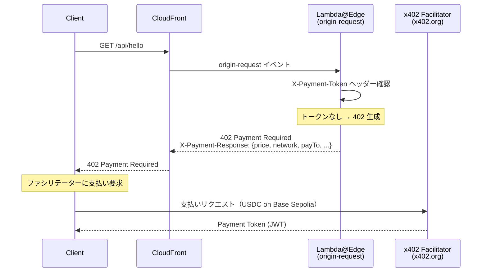
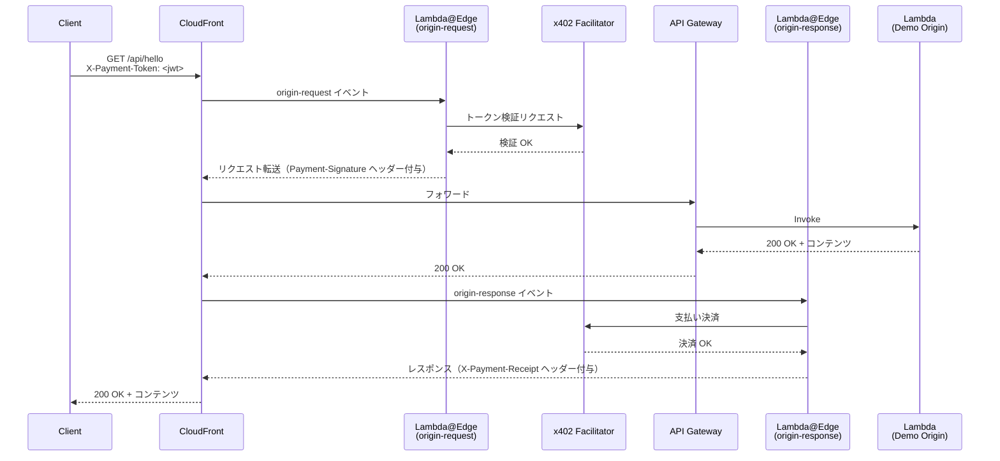
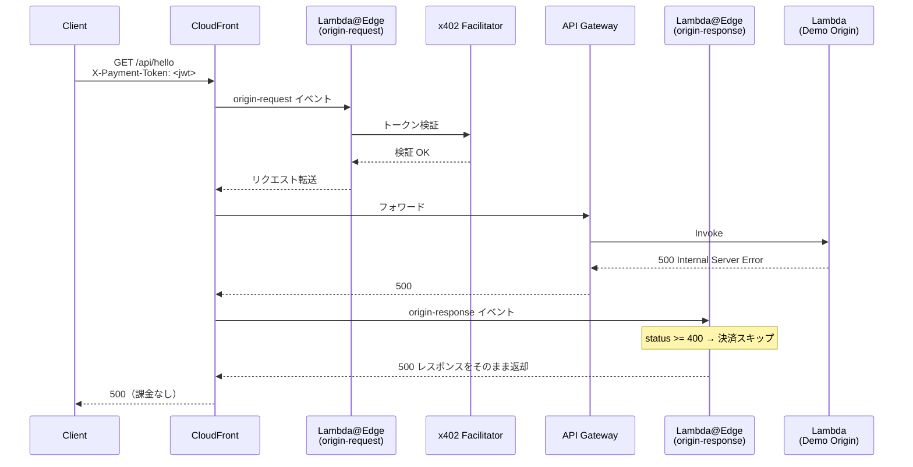

# x402 × CloudFront × Lambda@Edge — Payment Gateway Sample

> **x402 プロトコル**を使い、AWS CloudFront + Lambda@Edge でHTTPリクエストをマイクロペイメントでマネタイズするサンプル実装です。
> アカウント不要・APIキー不要 — 暗号学的ペイメントプルーフだけでコンテンツへのアクセスを制御します。

---

## 目次

- [概要](#概要)
- [機能一覧](#機能一覧)
- [アーキテクチャ](#アーキテクチャ)
- [シーケンス図](#シーケンス図)
- [技術スタック](#技術スタック)
- [動かし方](#動かし方)
- [テストスクリプト](#8-テストスクリプトscripts)
- [エンドポイント一覧](#エンドポイント一覧)
- [参考文献](#参考文献)

---

## 概要

**x402** は HTTP 402 Payment Required ステータスコードを活用した、オープンなHTTPペイメントプロトコルです。
このリポジトリは、x402 を AWS CloudFront + Lambda@Edge に統合し、**エッジレイヤーで支払い検証を行う**リファレンス実装を提供します。

```
クライアント 
  ──▶ CloudFront 
    ──▶ Lambda@Edge（支払い検証）
      ──▶ API Gateway 
        ──▶ Lambda（コンテンツ）
```

### なぜエッジで検証するのか？

| 方式 | レイテンシ | 改ざんリスク | スケーラビリティ |
|------|-----------|-------------|----------------|
| オリジンサーバー側で検証 | 高い（オリジンまで到達） | あり | オリジン依存 |
| **Lambda@Edge で検証（本実装）** | **低い（エッジで遮断）** | **なし（オリジンに未到達）** | **CloudFront スケール** |

---

## 機能一覧

| 機能 | 説明 |
|------|------|
| **エッジ支払い検証** | CloudFront の `origin-request` イベントで x402 トークンを検証。未払いリクエストはオリジンに到達しない |
| **エッジ支払い決済** | CloudFront の `origin-response` イベントでオリジン成功後のみ決済。失敗時は課金しない |
| **マルチルート対応** | パスパターン（`/api/*`, `/api/premium/**`, `/content/**`）ごとに異なる価格を設定可能 |
| **フリーエンドポイント** | デフォルトビヘイビア（`/`）は支払い不要でパススルー |
| **設定の完全分離** | 支払先アドレス・ネットワーク・ファシリテーターURLをすべて環境変数で管理 |
| **ランタイム環境変数不要** | Lambda@Edge は ENV をサポートしないため、esbuild `--define` でバンドル時に設定値を注入 |
| **Bun によるローカルバンドル** | Docker 不要のローカルバンドル（`bun install` + `esbuild`）。CI では Docker フォールバック |
| **USDC / Base Sepolia** | testnet: Base Sepolia（eip155:84532）で USDC マイクロペイメントを実証 |

---

## アーキテクチャ

```
┌─────────────────────────────────────────────────────────────────┐
│                        AWS CloudFront                           │
│                                                                 │
│  ┌────────────────────────────────────────────────────────┐    │
│  │  Behavior: /api/* , /content/*  （支払い保護）          │    │
│  │                                                        │    │
│  │   [origin-request]     [origin-response]               │    │
│  │   Lambda@Edge          Lambda@Edge                     │    │
│  │   ・トークン検証        ・支払い決済                     │    │
│  │   ・402 返却 or 転送    ・ヘッダー付与                   │    │
│  └────────────────────────────────────────────────────────┘    │
│                                                                 │
│  ┌────────────────────────────────────────────────────────┐    │
│  │  Behavior: /  （デフォルト・無料）                       │    │
│  └────────────────────────────────────────────────────────┘    │
└─────────────────────────────────────────────────────────────────┘
                              │
                    API Gateway (REST)
                              │
                    Lambda（Demo Origin）
                    ・GET /              無料
                    ・GET /api/hello     $0.001 USDC
                    ・GET /api/premium/* $0.01  USDC
                    ・GET /content/*     $0.005 USDC
```

---

## シーケンス図

### 1. 未払いリクエスト → 402 Payment Required



---

### 2. 支払い済みリクエスト → コンテンツ取得成功



---

### 3. オリジンエラー時（課金なし）



---

## 技術スタック

| レイヤー | 技術 | バージョン |
|---------|------|-----------|
| インフラ定義 | AWS CDK (TypeScript) | 2.232.1 |
| エッジロジック | AWS Lambda@Edge | Node.js 24.x |
| オリジン | AWS Lambda (Node.js) | Node.js 24.x |
| API層 | Amazon API Gateway (REST) | — |
| CDN | Amazon CloudFront | — |
| x402 プロトコル | @x402/core, @x402/evm | 2.2.0 |
| バンドラー | esbuild | ^0.27.2 |
| 言語 | TypeScript | ~5.9.3 |
| パッケージマネージャー | Bun | latest |
| フォーマッター/リンター | Biome | 2.4.8 |
| テスト | Jest + ts-jest | 29.x |
| ブロックチェーン | Base Sepolia (testnet) / Base (mainnet) | EVM |
| 決済トークン | USDC | — |

---

## 動かし方

### 前提条件

- [Bun](https://bun.sh/) がインストール済みであること
- [AWS CLI](https://aws.amazon.com/cli/) が設定済みであること（`aws configure`）
- [Node.js](https://nodejs.org/) 20+ がインストール済みであること
- USDC を受け取るウォレットアドレス（Base Sepolia testnet 用）

---

### 1. リポジトリのクローン

```bash
git clone https://github.com/your-org/x402-Cloudfront-LambdaEdge-Sample.git
cd x402-Cloudfront-LambdaEdge-Sample/cdk
```

---

### 2. 依存パッケージのインストール

```bash
# ルートの CDK 依存関係
bun install

# Lambda@Edge の依存関係
bun install --cwd functions/lambda-edge
```

---

### 3. 環境変数の設定

```bash
cp .env.example .env
```

`.env` を編集して以下の値を設定します：

```dotenv
# 必須: 支払いを受け取るウォレットアドレス
PAY_TO_ADDRESS=0xYourWalletAddressHere

# 任意: ネットワーク（デフォルト: Base Sepolia testnet）
X402_NETWORK=eip155:84532

# 任意: ファシリテーターURL（デフォルト: x402.org）
FACILITATOR_URL=https://x402.org/facilitator
```

> **Base Sepolia testnet の USDC を取得するには**
> [Coinbase Faucet](https://faucet.circle.com/) や [Alchemy Faucet](https://www.alchemy.com/faucets) を使用してください。

---

### 4. TypeScript ビルド

```bash
npm run build
```

---

### 5. CDK テンプレートの確認（オプション）

デプロイ前に生成される CloudFormation テンプレートを確認できます：

```bash
npx cdk synth
```

---

### 6. AWS へのデプロイ

```bash
# 初回のみ（CDK ブートストラップ）
npx cdk bootstrap

# デプロイ
npx cdk deploy
```

デプロイ完了後、以下のような出力が表示されます：

```
Outputs:
CdkStack.CloudFrontUrl        = https://xxxxxxxxxx.cloudfront.net
CdkStack.ApiGatewayUrl        = https://xxxxxxxxxx.execute-api.us-east-1.amazonaws.com/v1/
CdkStack.FreeEndpoint         = https://xxxxxxxxxx.cloudfront.net/
CdkStack.PaidEndpointHello    = https://xxxxxxxxxx.cloudfront.net/api/hello
CdkStack.PaidEndpointPremium  = https://xxxxxxxxxx.cloudfront.net/api/premium/data
CdkStack.PaidEndpointContent  = https://xxxxxxxxxx.cloudfront.net/content/article
```

---

### 7. 動作確認

#### 無料エンドポイント（支払い不要）

```bash
curl https://xxxxxxxxxx.cloudfront.net/
```

#### 有料エンドポイント（支払いなし → 402）

```bash
curl -i https://xxxxxxxxxx.cloudfront.net/api/hello
# HTTP/2 402
# X-Payment-Response: {"accepts":[{"price":"$0.001","network":"eip155:84532",...}]}
```

#### 有料エンドポイント（x402 クライアント使用）

```typescript
import { withPaymentInterceptor } from "@x402/fetch";

const fetchWithPayment = withPaymentInterceptor(fetch, wallet);
const res = await fetchWithPayment("https://xxxxxxxxxx.cloudfront.net/api/hello");
const data = await res.json();
console.log(data); // { message: "Hello from the paid endpoint!", ... }
```

#### 実行結果例

```json
{
  "x402Version": 2,
  "error": "Payment required",
  "resource": {
    "url": "https://<固有値>.cloudfront.net/api/premium/data",
    "description": "API access ($0.001 USDC)",
    "mimeType": ""
  },
  "accepts": [
    {
      "scheme": "exact",
      "network": "eip155:84532",
      "amount": "1000",
      "asset": "0x036CbD53842c5426634e7929541eC2318f3dCF7e",
      "payTo": "0xYourPaymentAddressHere",
      "maxTimeoutSeconds": 300,
      "extra": {
        "name": "USDC",
        "version": "2"
      }
    }
  ]
}
```

```json
{
  "x402Version": 2,
  "error": "Payment required",
  "resource": {
    "url": "https://<固有値>.cloudfront.net/content/article",
    "description": "Premium content ($0.005 USDC)",
    "mimeType": ""
  },
  "accepts": [
    {
      "scheme": "exact",
      "network": "eip155:84532",
      "amount": "5000",
      "asset": "0x036CbD53842c5426634e7929541eC2318f3dCF7e",
      "payTo": "0xYourPaymentAddressHere",
      "maxTimeoutSeconds": 300,
      "extra": {
        "name": "USDC",
        "version": "2"
      }
    }
  ]
}
```

---

### ローカル開発・テスト

```bash
cd cdk

# ウォッチモード（TypeScript 自動コンパイル）
npm run watch

# テスト実行
npm run test

# フォーマット
npm run format

# スタックの差分確認
npx cdk diff
```

---

### スタックの削除

```bash
npx cdk destroy
```

---

### 8. テストスクリプト（scripts/）

`scripts/` には、x402 支払いペイロードの生成と動作検証を行うスクリプトが含まれています。
`test.http`（VS Code REST Client）と組み合わせた手動テストや、フル支払いフローの確認に使用してください。

#### セットアップ

```bash
# 環境変数ファイルを作成
cp scripts/.env.example scripts/.env
```

`scripts/.env` を編集して2つの値を設定します：

```dotenv
# Base Sepolia テストネット用ウォレットの秘密鍵
EVM_PRIVATE_KEY=0x_YOUR_PRIVATE_KEY_HERE

# cdk deploy 後に出力される CloudFrontUrl
CLOUDFRONT_URL=https://XXXXX.cloudfront.net
```

```bash
# 依存パッケージをインストール
cd scripts && bun install
```

> **テスト用 USDC の取得**
> [Circle Faucet](https://faucet.circle.com/) で「Base Sepolia」を選択して USDC を取得してください。

---

#### generate モード — 署名済みペイロードを生成（決済なし）

`test.http` の `@paymentPayload` に貼り付ける値を生成します。実際のオンチェーン決済は行いません。

```bash
cd scripts

bun run generate                  # /api/hello のペイロードを生成
bun run generate:premium          # /api/premium/data のペイロードを生成
bun run generate:content          # /content/article のペイロードを生成

# または直接実行
bun run generate-payment.ts /api/hello
```

**出力例：**

```
x402 Payment Script
Mode:     ペイロード生成のみ (デフォルト)
Endpoint: /api/hello

────────────────────────────────────────────────────
Step 1: 支払いなしでリクエスト → 402 Payment Required
────────────────────────────────────────────────────
Status: 402 Payment Required

Payment Requirements:
  Network :  eip155:84532
  Price   :  $0.001000 USDC
  Pay To  :  0xYourPaymentAddressHere

────────────────────────────────────────────────────
Step 2: 支払いペイロードを署名生成（オンチェーン決済はしない）
────────────────────────────────────────────────────
Wallet:  0xYourWalletAddress
Balance: 1.234567 USDC (Base Sepolia)

════════════════════════════════════════════════════
生成された Payment-Signature (test.http の @paymentPayload に貼り付け):
════════════════════════════════════════════════════
eyJwYXlsb2FkIjp7InNjaGVtZSI6ImV4YWN0IiwibmV0d29yayI6...（base64）
════════════════════════════════════════════════════

注意: このシグネチャはリプレイ保護により 1 回限り有効です。
```

生成された値を `test.http` に貼り付けます：

```http
@paymentPayload = eyJwYXlsb2FkIjp7InNjaGVtZSI6ImV4YWN0IiwibmV0d29yayI6...
```

---

#### pay モード — フル支払い（実際に USDC を消費）

402 取得 → 署名 → 再送 → オリジンからレスポンス取得の完全なフローを実行します。

```bash
cd scripts

bun run pay                       # /api/hello を支払い
bun run pay:premium               # /api/premium/data を支払い
bun run pay:content               # /content/article を支払い
```

**出力例：**

```bash
x402 Payment Script
Mode:     フル支払い (--pay) ※ 実際に USDC を消費します
Endpoint: /api/hello

────────────────────────────────────────────────────────────
Step 1: 支払いなしでリクエスト → 402 Payment Required
────────────────────────────────────────────────────────────
URL: https://d7fozeailth4i.cloudfront.net/api/hello

Status: 402 Payment Required

Payment Requirements:
  Network :  eip155:84532
  Price   :  $0.001000 USDC
  Pay To  :  0xe6AA1B60c4EC760668dB3C06d7A894c5Fd39D0aa
  Asset   :  0x036CbD53842c5426634e7929541eC2318f3dCF7e

────────────────────────────────────────────────────────────
Step 2 + 3: 支払い → オリジンからレスポンス取得
────────────────────────────────────────────────────────────
Wallet: 0xe6AA1B60c4EC760668dB3C06d7A894c5Fd39D0aa
Balance (before): 60.000000 USDC

支払い中...

Status: 200 OK
Response: {
  "message": "Hello from the paid endpoint!",
  "data": {
    "greeting": "You successfully paid $0.001 USDC to access this content.",
    "timestamp": "2026-03-20T15:52:20.237Z",
    "network": "Base Sepolia",
    "protocol": "x402 v2"
  }
}

Balance (after): 60.000000 USDC

════════════════════════════════════════════════════════════
支払い完了!
════════════════════════════════════════════════════════════
```

```bash
────────────────────────────────────────────────────────────
Step 1: 支払いなしでリクエスト → 402 Payment Required
────────────────────────────────────────────────────────────
URL: https://d7fozeailth4i.cloudfront.net/content/article

Status: 402 Payment Required

Payment Requirements:
  Network :  eip155:84532
  Price   :  $0.005000 USDC
  Pay To  :  0xe6AA1B60c4EC760668dB3C06d7A894c5Fd39D0aa
  Asset   :  0x036CbD53842c5426634e7929541eC2318f3dCF7e

────────────────────────────────────────────────────────────
Step 2 + 3: 支払い → オリジンからレスポンス取得
────────────────────────────────────────────────────────────
Wallet: 0xe6AA1B60c4EC760668dB3C06d7A894c5Fd39D0aa
Balance (before): 60.000000 USDC

支払い中...

Status: 200 OK
Response: {
  "title": "The Future of AI Micropayments",
  "content": "x402 enables AI agents to autonomously pay for APIs using USDC on Base. No accounts, no API keys — just cryptographic payment proofs verified on-chain.",
  "author": "x402 Demo",
  "publishedAt": "2026-01-01",
  "readTime": "2 min"
}

Balance (after): 60.000000 USDC

════════════════════════════════════════════════════════════
支払い完了!
════════════════════════════════════════════════════════════
```

[実際に送金されたトランザクション](https://sepolia.basescan.org/tx/0x2236d96d357499bfdb896ec9d19aa1ea99a9b94fe460c89bc56e4885dd349a8a)

[実際に送金されたトランザクション - コンテンツ](https://sepolia.basescan.org/tx/0x59be0a685b6dc22013e1620b71c5d740bfddeee6131410b2d8d80e93855039da)

---

## エンドポイント一覧

| パス | 支払い | 価格 | 説明 |
|------|--------|------|------|
| `GET /` | 不要 | 無料 | ウェルカムページ・エンドポイント一覧 |
| `GET /api/hello` | 必要 | $0.001 USDC | ハローエンドポイント |
| `GET /api/premium/data` | 必要 | $0.01 USDC | プレミアムデータエンドポイント |
| `GET /content/article` | 必要 | $0.005 USDC | プレミアム記事コンテンツ |

---

## 参考文献

- [Monetize Any HTTP Application with x402 and CloudFront + Lambda@Edge](https://builder.aws.com/content/38fLQk6zKRfLnaUNzcLPsUexUlZ/monetize-any-http-application-with-x402-and-cloudfront-lambdaedge)
- [Coinbase x402 GitHub — CloudFront Lambda@Edge Example](https://github.com/coinbase/x402/tree/main/examples/typescript/servers/cloudfront-lambda-edge)
- [x402 Protocol Specification](https://x402.org)
- [AWS Lambda@Edge ドキュメント](https://docs.aws.amazon.com/AmazonCloudFront/latest/DeveloperGuide/lambda-at-the-edge.html)
