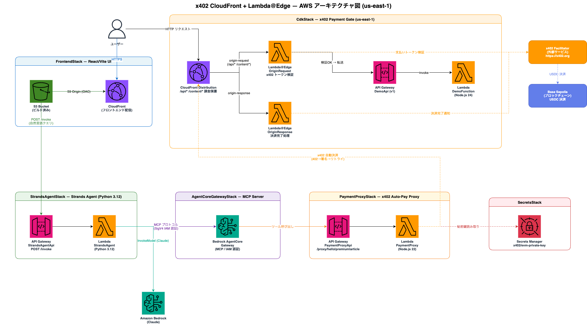
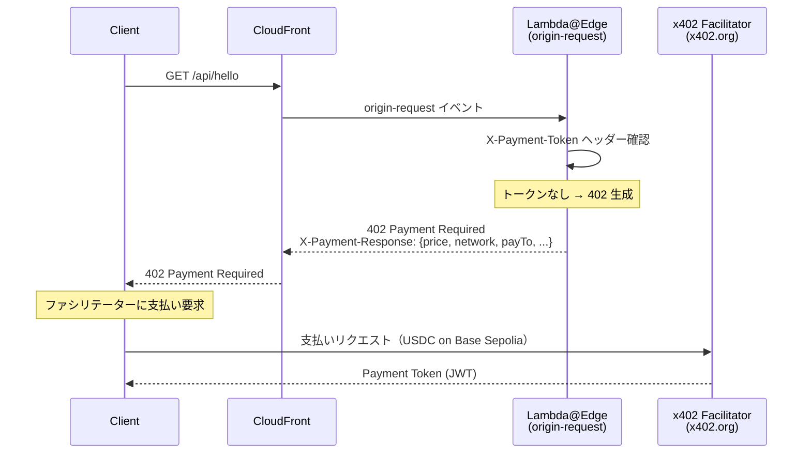
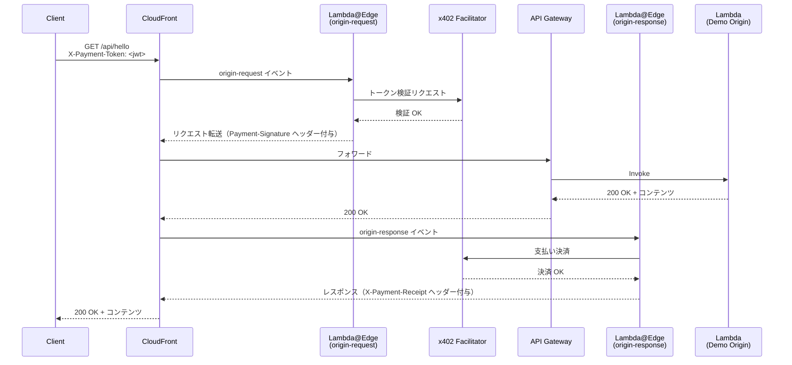
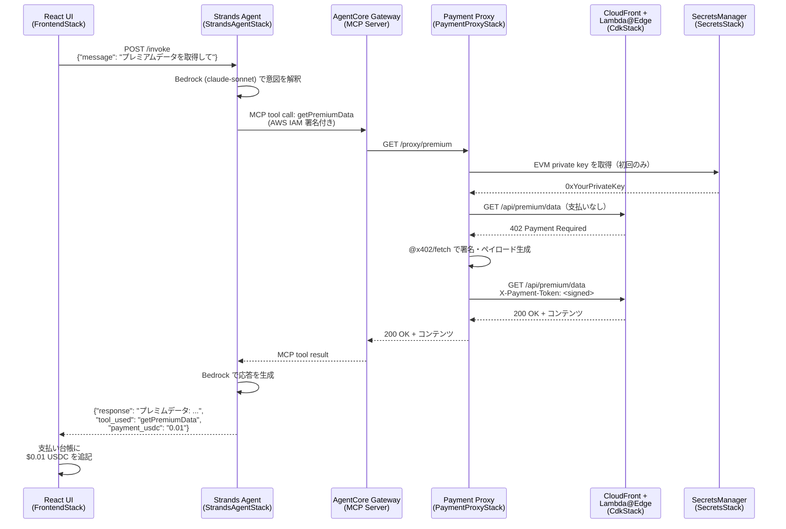
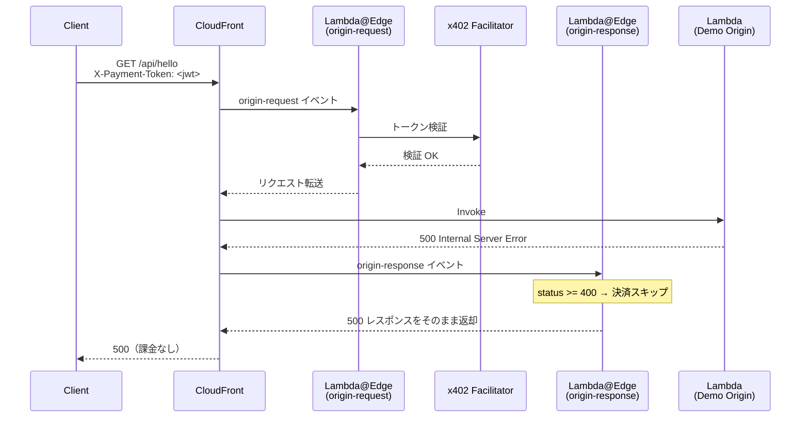

# x402 × CloudFront × Lambda@Edge — AI Payment Gateway Sample

> **x402 プロトコル**を使い、AWS CloudFront + Lambda@Edge でHTTPリクエストをマイクロペイメントでマネタイズするサンプル実装です。
> アカウント不要・APIキー不要 — 暗号学的ペイメントプルーフだけでコンテンツへのアクセスを制御します。
>
> **Base Sepolia (EVM)** と **Solana Devnet** の両方をサポートし、クライアントはどちらのネットワークで支払っても OK です。
>
> さらに **Strands Agent × AgentCore Gateway (MCP)** を統合し、**AIエージェントが自律的にUSDCで支払いながらコンテンツを取得する** エンドツーエンドのデモを提供します。

---

## 目次

- [概要](#概要)
- [全体アーキテクチャ](#全体アーキテクチャ)
- [CDK スタック構成](#cdk-スタック構成)
- [シーケンス図](#シーケンス図)
- [技術スタック](#技術スタック)
- [ディレクトリ構成](#ディレクトリ構成)
- [動かし方](#動かし方)
  - [Phase A: 既存 x402 エッジゲートウェイのデプロイ](#phase-a-既存-x402-エッジゲートウェイのデプロイ)
  - [Phase B: AI Agent レイヤーのデプロイ](#phase-b-ai-agent-レイヤーのデプロイ)
  - [Phase C: フロントエンドのデプロイ](#phase-c-フロントエンドのデプロイ)
- [テストスクリプト](#テストスクリプトscripts)
- [エンドポイント一覧](#エンドポイント一覧)
- [参考文献](#参考文献)

---

## 概要

**x402** は HTTP 402 Payment Required ステータスコードを活用した、オープンなHTTPペイメントプロトコルです。
このリポジトリは以下の2層で構成されています。

### Layer 1 — x402 エッジゲートウェイ（既存）

CloudFront + Lambda@Edge がリクエストをエッジで検証・決済します。  
オリジンサーバーへのアクセスは支払い済みリクエストのみ許可されます。

```
Client → CloudFront → Lambda@Edge (検証) → API GW → Lambda (コンテンツ)
```

### Layer 2 — AI Agent レイヤー（新規）

AIエージェント（Strands Agent）が MCP プロトコル経由で x402 保護コンテンツに自律的にアクセスします。
ユーザーは自然言語でリクエストするだけ — 支払いはエージェントが自動処理します。

```
React UI → Strands Agent → AgentCore Gateway (MCP) → Payment Proxy → CloudFront (x402)
```

### なぜエッジで検証するのか？

| 方式 | レイテンシ | 改ざんリスク | スケーラビリティ |
|------|-----------|-------------|----------------|
| オリジンサーバー側で検証 | 高い（オリジンまで到達） | あり | オリジン依存 |
| **Lambda@Edge で検証<br/>（本実装）** | **低い（エッジで遮断）** | **なし（オリジンに未到達）** | **CloudFront スケール** |

---

## 全体アーキテクチャ



```
┌──────────────────────────────────────────────────────────────────┐
│  [FrontendStack]  CloudFront (S3)                                │
│  React "Neon Noir Payment Terminal" UI                           │
│  ・左ペイン: AIチャット  ・右ペイン: 支払い台帳                    │
└────────────────────────┬─────────────────────────────────────────┘
                         │ POST /invoke
┌────────────────────────▼─────────────────────────────────────────┐
│  [StrandsAgentStack]  API GW → Strands Agent Lambda (Python)     │
│  ・Bedrock claude-sonnet-4-6 でユーザーの自然言語を解釈            │
│  ・MCP ツールを呼び出してコンテンツを取得                           │
└────────────────────────┬─────────────────────────────────────────┘
                         │ MCP protocol (HTTP/Streamable)
                         │ AWS IAM 認証
┌────────────────────────▼─────────────────────────────────────────┐
│  [AgentCoreGatewayStack]  AgentCore Gateway (MCP Server)         │
│  ・Payment Proxy API を MCP ツールとして公開                       │
│  ・getHelloContent / getPremiumData / getArticleContent          │
└────────────────────────┬─────────────────────────────────────────┘
                         │ HTTP call
┌────────────────────────▼─────────────────────────────────────────┐
│  [PaymentProxyStack]  API GW → Payment Proxy Lambda (TypeScript) │
│  ・x402 フロー（402受信 → @x402/fetch で署名 → リトライ）を内部完結 │
│  ・EVM private key は SecretsManager から取得                      │
└────────────────────────┬─────────────────────────────────────────┘
                         │ HTTPS + X-Payment-Token header
┌────────────────────────▼─────────────────────────────────────────┐
│  [CdkStack（既存）]  CloudFront → Lambda@Edge → API GW → Lambda  │
│  ・origin-request: トークン検証 / 402 返却                         │
│  ・origin-response: 支払い決済（オリジン成功時のみ）                │
└──────────────────────────────────────────────────────────────────┘
```

---

## CDK スタック構成

| スタック | ファイル | 役割 |
|---------|---------|------|
| `SecretsStack` | `lib/secrets-stack.ts` | EVM / Solana private key を SecretsManager で管理 |
| `CdkStack` | `lib/cdk-stack.ts` | CloudFront + Lambda@Edge (x402 エッジゲートウェイ) |
| `PaymentProxyStack` | `lib/payment-proxy-stack.ts` | x402 自動支払いプロキシ Lambda + API GW |
| `AgentCoreGatewayStack` | `lib/agent-core-gateway-stack.ts` | AgentCore Gateway (MCP Server) |
| `StrandsAgentStack` | `lib/strands-agent-stack.ts` | Strands Agent Lambda (Python) + API GW |
| `FrontendStack` | `lib/frontend-stack.ts` | React UI の CloudFront + S3 配信 |

### スタック依存関係

```
SecretsStack ────────────────────────────────────┐
                                                  ↓
CdkStack（既存）─────────────────────→ PaymentProxyStack
                                                  ↓
                                     AgentCoreGatewayStack
                                                  ↓
                                      StrandsAgentStack
                                                  ↓
                                       FrontendStack
```

---

## シーケンス図

### 1. x402 基本フロー — 未払い → 402



### 2. x402 基本フロー — 支払い済み → 成功



### 3. AI Agent フロー — エンドツーエンド



### 4. オリジンエラー時（課金なし）



---

## 技術スタック

| レイヤー | 技術 | バージョン |
|---------|------|-----------|
| **インフラ定義** | AWS CDK (TypeScript) | 2.232.1 |
| **エッジロジック** | AWS Lambda@Edge | Node.js 24.x |
| **オリジン Lambda** | AWS Lambda (Node.js) | Node.js 24.x |
| **支払いプロキシ** | AWS Lambda (Node.js) | Node.js 22.x |
| **AI エージェント** | Strands Agents (Python) | ≥ 1.32.0 |
| **AI モデル** | Amazon Bedrock (Claude Sonnet 4.6) | claude-sonnet-4-6 |
| **MCP サーバー** | AgentCore Gateway | GA (2025/10〜) |
| **API 層** | Amazon API Gateway (REST) | — |
| **CDN** | Amazon CloudFront | — |
| **シークレット管理** | AWS Secrets Manager | — |
| **フロントエンド** | React 19 + Vite 8 + framer-motion | — |
| **x402 プロトコル** | @x402/core, @x402/evm, @x402/svm, @x402/fetch | 2.2.0 |
| **バンドラー** | esbuild | ^0.27.2 |
| **言語** | TypeScript 5.9.3 / Python 3.12 | — |
| **パッケージマネージャー** | Bun | latest |
| **フォーマッター/リンター** | Biome | 2.4.8 |
| **テスト** | Jest + ts-jest | 29.x |
| **ブロックチェーン** | Base Sepolia (testnet) / Base (mainnet) | EVM |
| **ブロックチェーン** | Solana Devnet (testnet) / Solana Mainnet | SVM |
| **決済トークン** | USDC | — |

---

## ディレクトリ構成

```
x402-Cloudfront-LambdaEdge-Sample/
├── cdk/                                    # CDK アプリ本体
│   ├── bin/
│   │   └── cdk.ts                          # 全スタックのエントリーポイント
│   ├── lib/
│   │   ├── cdk-stack.ts                    # ★ 既存: CloudFront + Lambda@Edge
│   │   ├── secrets-stack.ts               # Phase 1: SecretsManager
│   │   ├── payment-proxy-stack.ts         # Phase 3: x402 プロキシ
│   │   ├── agent-core-gateway-stack.ts    # Phase 4: AgentCore Gateway (MCP)
│   │   ├── strands-agent-stack.ts         # Phase 5: Strands Agent
│   │   └── frontend-stack.ts             # Phase 7: CloudFront + S3
│   ├── functions/
│   │   ├── lambda-edge/                   # ★ 既存: 支払い検証・決済
│   │   │   └── src/
│   │   │       ├── index.ts
│   │   │       ├── origin-request.ts
│   │   │       ├── origin-response.ts
│   │   │       └── lib/
│   │   ├── lambda-demo/                   # ★ 既存: デモ Origin
│   │   ├── payment-proxy/                 # 新規: x402 自動支払いプロキシ
│   │   │   ├── index.ts
│   │   │   └── package.json
│   │   └── strands-agent/                 # 新規: Strands Agent (Python)
│   │       ├── agent.py
│   │       └── requirements.txt
│   └── openapi/
│       └── payment-proxy-api.yaml         # AgentCore Gateway 用 OpenAPI spec
├── frontend/                              # React/Vite UI
│   ├── index.html
│   └── src/
│       ├── App.tsx                        # メインレイアウト
│       ├── App.css                        # Neon Noir デザイン
│       ├── components/
│       │   ├── ChatPanel.tsx              # 左ペイン: AIチャット
│       │   ├── MessageBubble.tsx          # チャットメッセージ
│       │   ├── PaymentLedger.tsx          # 右ペイン: 支払い台帳
│       │   ├── PaymentCard.tsx            # 支払いトランザクション
│       │   ├── ToolBadge.tsx              # MCPツール + 価格バッジ
│       │   ├── StatusBar.tsx              # 接続状態バー
│       │   └── ThinkingDots.tsx           # Agent 思考中アニメーション
│       ├── hooks/
│       │   └── useAgent.ts               # Strands Agent API フック
│       ├── lib/
│       │   └── config.ts                 # config.json ローダー
│       └── types/
│           └── index.ts                  # 共有型定義
├── scripts/                               # 支払いテストスクリプト
└── docs/
    └── IMPLEMENTATION_PLAN.md            # 実装計画書
```

---

## 動かし方

### 前提条件

- [Bun](https://bun.sh/) がインストール済みであること
- [AWS CLI](https://aws.amazon.com/cli/) が設定済みであること（`aws configure`）
- [Node.js](https://nodejs.org/) 20+ がインストール済みであること
- Python 3.12 がインストール済みであること（Strands Agent Lambda ビルド用）
- USDC を受け取るウォレットアドレス（EVM / Solana それぞれ）
- x402 支払い署名用 EVM ウォレットの秘密鍵（Payment Proxy 用）
- x402 支払い署名用 Solana ウォレットの秘密鍵 base58 形式（Payment Proxy 用）

> **テストネット USDC の取得**
>
> - **Base Sepolia:** [Coinbase Faucet](https://faucet.circle.com/) で「Base Sepolia」を選択
> - **Solana Devnet:** `solana airdrop 2 <WALLET_ADDRESS> --url devnet` で SOL を取得後、[spl-token faucet](https://spl-token-faucet.com/) で USDC を取得

---

### Phase A: 既存 x402 エッジゲートウェイのデプロイ

#### 1. リポジトリのクローン

```bash
git clone https://github.com/your-org/x402-Cloudfront-LambdaEdge-Sample.git
cd x402-Cloudfront-LambdaEdge-Sample
```

#### 2. CDK 依存パッケージのインストール

```bash
cd cdk
bun install

# Lambda@Edge の依存関係
bun install --cwd functions/lambda-edge
```

#### 3. 環境変数の設定

```bash
cp .env.example .env
```

`.env` を編集して以下の値を設定します：

```dotenv
# 必須: EVM 支払いを受け取るウォレットアドレス
PAY_TO_ADDRESS=0xYourEVMWalletAddressHere

# 必須: Solana 支払いを受け取るウォレットアドレス
SVM_PAY_TO_ADDRESS=YourSolanaWalletAddressHere

# 任意: EVM ネットワーク（デフォルト: Base Sepolia testnet）
X402_NETWORK=eip155:84532

# 任意: Solana ネットワーク（デフォルト: Solana Devnet）
SOLANA_NETWORK=solana:EtWTRABZaYq6iMfeYKouRu166VU2xqa1

# 任意: ファシリテーターURL（デフォルト: x402.org、testnet は EVM/Solana 共通）
FACILITATOR_URL=https://x402.org/facilitator
```

#### 4. TypeScript ビルド

```bash
npm run build
```

#### 5. CDK ブートストラップ（初回のみ）

```bash
npx cdk bootstrap
```

#### 6. CdkStack のデプロイ

```bash
PAY_TO_ADDRESS=0xYourAddress bunx cdk deploy CdkStack
```

デプロイ完了後、以下の出力が表示されます：

```
Outputs:
CdkStack.CloudFrontUrl        = https://xxxxxxxxxx.cloudfront.net
CdkStack.ApiGatewayUrl        = https://xxxxxxxxxx.execute-api.us-east-1.amazonaws.com/v1/
CdkStack.FreeEndpoint         = https://xxxxxxxxxx.cloudfront.net/
CdkStack.PaidEndpointHello    = https://xxxxxxxxxx.cloudfront.net/api/hello
CdkStack.PaidEndpointPremium  = https://xxxxxxxxxx.cloudfront.net/api/premium/data
CdkStack.PaidEndpointContent  = https://xxxxxxxxxx.cloudfront.net/content/article
```

#### 7. 動作確認

```bash
# 無料エンドポイント
curl https://xxxxxxxxxx.cloudfront.net/

# 有料エンドポイント（支払いなし → 402）
curl -i https://xxxxxxxxxx.cloudfront.net/api/hello
# HTTP/2 402
# X-Payment-Response: {"accepts":[{"price":"$0.001","network":"eip155:84532",...}]}
```

---

### Phase B: AI Agent レイヤーのデプロイ

#### 1. SecretsStack のデプロイ

```bash
bunx cdk deploy SecretsStack
```

以下のようになればOK!

```bash
✅  SecretsStack

✨  Deployment time: 27.9s
```

#### 2. 秘密鍵をシークレットに設定

Payment Proxy Lambda が x402 支払いに使用する秘密鍵を設定します。
**各ウォレットにテストネット USDC を入金しておいてください。**

```bash
# EVM 秘密鍵（Base Sepolia 用）
aws secretsmanager put-secret-value \
  --secret-id x402/evm-private-key \
  --secret-string "0xYOUR_EVM_PRIVATE_KEY" \
  --region us-east-1

# Solana 秘密鍵（Devnet 用、base58 形式）
aws secretsmanager put-secret-value \
  --secret-id x402/svm-private-key \
  --secret-string "YOUR_SOLANA_BASE58_PRIVATE_KEY" \
  --region us-east-1
```

> **Solana 秘密鍵の base58 エクスポート方法:**
> ```bash
> # Solana CLI を使っている場合
> cat ~/.config/solana/id.json | python3 -c "import sys,json,base58; print(base58.b58encode(bytes(json.load(sys.stdin))).decode())"
> ```

#### 3. PaymentProxyStack のデプロイ

```bash
bunx cdk deploy PaymentProxyStack
```

以下のようになればOK!

```bash
 ✅  PaymentProxyStack

✨  Deployment time: 94.75s
```

#### 4. AgentCoreGatewayStack のデプロイ

```bash
bunx cdk deploy AgentCoreGatewayStack
```

以下のようになればOK!

```bash
✅  AgentCoreGatewayStack

✨  Deployment time: 134.11s
```

> **対応リージョン:** us-east-1 / us-east-2 / us-west-2 / ap-northeast-1 他

**MCP Inspector**を使った稼働確認

```bash
npx @modelcontextprotocol/inspector
```

#### 5. StrandsAgentStack のデプロイ

```bash
bunx cdk deploy StrandsAgentStack
```

以下のようになればOK!

```bash
 ✅  StrandsAgentStack

✨  Deployment time: 89.06s
```

> **Bedrock モデルアクセスの有効化**
> AWS Console → Bedrock → Model access で `Claude Sonnet 4.6` のアクセスを有効化してください。

---

### Phase C: フロントエンドのデプロイ

#### 1. フロントエンド依存パッケージのインストール

```bash
cd frontend
bun install
```

#### 2. フロントエンドのビルド

```bash
bun run build
```

#### 3. FrontendStack のデプロイ

```bash
cd ../cdk
npx cdk deploy FrontendStack
```

デプロイ完了後：

```
Outputs:
FrontendStack.FrontendUrl = https://yyyyyyyyyy.cloudfront.net
```

ブラウザで `FrontendUrl` を開くと、Neon Noir デザインの AI Payment Terminal が表示されます。

---

### 全スタック一括デプロイ

```bash
cd cdk

# 全スタックをまとめてデプロイ（SecretsStack は先にデプロイし、秘密鍵設定後に残りを実行）
bunx cdk deploy SecretsStack

aws secretsmanager put-secret-value \
  --secret-id x402/evm-private-key \
  --secret-string "0xYOUR_EVM_PRIVATE_KEY"

aws secretsmanager put-secret-value \
  --secret-id x402/svm-private-key \
  --secret-string "YOUR_SOLANA_BASE58_PRIVATE_KEY"

PAY_TO_ADDRESS=0xYourEVMAddress \
SVM_PAY_TO_ADDRESS=YourSolanaAddress \
npx cdk deploy CdkStack PaymentProxyStack AgentCoreGatewayStack StrandsAgentStack

cd ../frontend && bun run build && cd ../cdk
bunx cdk deploy FrontendStack
```

---

### ローカル開発

```bash
cd cdk

# ウォッチモード（TypeScript 自動コンパイル）
npm run watch

# テスト実行
npm run test

# フォーマット
npm run format

# スタックの差分確認
npx cdk diff

# CDK テンプレート確認
npx cdk synth
```

---

### スタックの削除

```bash
cd cdk
npx cdk destroy --all
```

Lambda@Edgeだけは数時間後(レプリカが削除された後)に手動で削除する必要があるので注意です。

```bash
aws lambda delete-function --function-name CdkStack-OriginResponseFn0BEDF56E-RYprtghbLxd7 --region us-east-1
aws lambda delete-function --function-name CdkStack-OriginRequestFn5947795F-p5ZOi0xo6Fi9 --region us-east-1
```

---

## テストスクリプト（scripts/）

`scripts/` には x402 支払いペイロードの生成と動作検証を行うスクリプトが含まれています。

### セットアップ

```bash
cp scripts/.env.example scripts/.env
```

`scripts/.env` を編集：

```dotenv
# EVM 秘密鍵（Base Sepolia テストネット用）
EVM_PRIVATE_KEY=0x_YOUR_EVM_PRIVATE_KEY_HERE

# Solana 秘密鍵（Solana Devnet 用、base58 形式）※ EVM または Solana どちらか一方でも可
SVM_PRIVATE_KEY=YOUR_SOLANA_BASE58_PRIVATE_KEY_HERE

# cdk deploy 後に出力される CloudFrontUrl
CLOUDFRONT_URL=https://XXXXX.cloudfront.net
```

```bash
cd scripts && bun install
```

### generate モード — 署名済みペイロードを生成（決済なし）

```bash
cd scripts
bun run generate           # /api/hello のペイロードを生成
bun run generate:premium   # /api/premium/data のペイロードを生成
bun run generate:content   # /content/article のペイロードを生成
```

### pay モード — フル支払い（実際に USDC を消費）

```bash
cd scripts
bun run pay                # /api/hello を支払い
bun run pay:premium        # /api/premium/data を支払い
bun run pay:content        # /content/article を支払い
```

**出力例:**

```
x402 Payment Script
Mode:     フル支払い (--pay) ※ 実際に USDC を消費します
Endpoint: /api/hello

Status: 200 OK
Response: {
  "message": "Hello from the paid endpoint!",
  "data": {
    "greeting": "You successfully paid $0.001 USDC to access this content.",
    "timestamp": "2026-01-01T00:00:00.000Z",
    "network": "Base Sepolia",
    "protocol": "x402 v2"
  }
}

════════════════════════════════════════
支払い完了!
════════════════════════════════════════
```

---

## エンドポイント一覧

### x402 エッジゲートウェイ（CdkStack）

| パス | 支払い | 価格 | 対応ネットワーク | 説明 |
|------|--------|------|----------------|------|
| `GET /` | 不要 | 無料 | — | ウェルカムページ |
| `GET /api/hello` | 必要 | $0.001 USDC | Base Sepolia / Solana Devnet | ハローエンドポイント |
| `GET /api/premium/data` | 必要 | $0.01 USDC | Base Sepolia / Solana Devnet | プレミアムデータ |
| `GET /content/article` | 必要 | $0.005 USDC | Base Sepolia / Solana Devnet | プレミアム記事 |

クライアントは 402 レスポンスの `accepts` リストから任意のネットワークを選択して支払えます。

### Payment Proxy（PaymentProxyStack）

| パス | 説明 |
|------|------|
| `GET /proxy/hello` | `/api/hello` への自動支払いプロキシ |
| `GET /proxy/premium` | `/api/premium/data` への自動支払いプロキシ |
| `GET /proxy/article` | `/content/article` への自動支払いプロキシ |

### Strands Agent（StrandsAgentStack）

| パス | メソッド | 説明 |
|------|---------|------|
| `/invoke` | `POST` | AIエージェントにメッセージを送信 |

**リクエスト例:**

```bash
curl -X POST https://xxxxxxxxxx.execute-api.us-east-1.amazonaws.com/v1/invoke \
  -H "Content-Type: application/json" \
  -d '{"message": "プレミアムアナリティクスデータを取得して", "session_id": "test-001"}'
```

**レスポンス例:**

```json
{
  "session_id": "test-001",
  "response": "プレミアムアナリティクスデータを取得しました。...",
  "tool_used": "getPremiumData",
  "payment_usdc": "0.01"
}
```

---

## フロントエンド UI

**"Neon Noir Payment Terminal"** — x402 の「AIが自律的に支払いを行う」コンセプトを体現するデザイン。

| 要素 | 選択 | 理由 |
|------|------|------|
| 背景 | `#080B14`（深紺） | 金融端末・ブルームバーグ端末感 |
| x402 支払い色 | `#00E5CC`（電気ティール） | 送金成功の「通電」感 |
| USDC 金額色 | `#F5A623`（アンバー/金） | 暗号資産のゴールド感 |
| AI/Agent 色 | `#8B5CF6`（パープル） | 知性・AIの象徴色 |
| 表示フォント | `Sora` (Google Fonts) | 現代的・ジオメトリック |
| 等幅フォント | `JetBrains Mono` | アドレス・ハッシュ表示 |
| レイアウト | 左: チャット / 右: 支払い台帳 | 操作と結果を同時表示 |
| アニメーション | framer-motion | カード登場・メッセージフェード |

---

## 参考文献

- [Monetize Any HTTP Application with x402 and CloudFront + Lambda@Edge](https://builder.aws.com/content/38fLQk6zKRfLnaUNzcLPsUexUlZ/monetize-any-http-application-with-x402-and-cloudfront-lambdaedge)
- [Coinbase x402 GitHub — CloudFront Lambda@Edge Example](https://github.com/coinbase/x402/tree/main/examples/typescript/servers/cloudfront-lambda-edge)
- [x402 Protocol Specification](https://x402.org)
- [AWS Bedrock AgentCore Gateway ドキュメント](https://docs.aws.amazon.com/bedrock/latest/userguide/agentcore-gateway.html)
- [Strands Agents SDK](https://github.com/strands-agents/sdk-python)
- [AWS Lambda@Edge ドキュメント](https://docs.aws.amazon.com/AmazonCloudFront/latest/DeveloperGuide/lambda-at-the-edge.html)
- [Model Context Protocol (MCP)](https://modelcontextprotocol.io/)
- [実際のトランザクション記録](https://sepolia.basescan.org/tx/0x9cdbb690d4740a30b98e7cc60ee45a819a909721f4c470ae25b808f510d3fc64)
- [LT登壇スライド](https://speakerdeck.com/mashharuki/solana-x-x402-x-aws-detukurusuper-ai-payment-gateway)